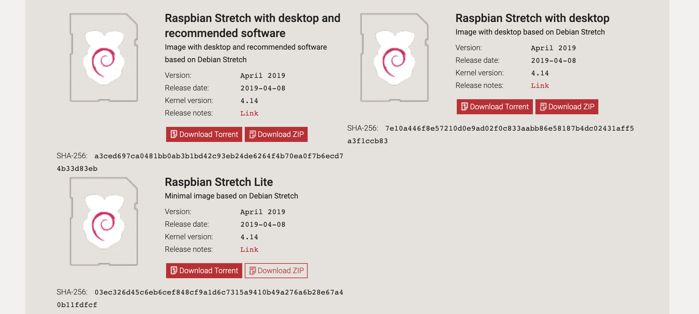

# Raspberry come AP

Questa guida siega gli step per impostare il vostro raspberry come access point WiFi e cosa fare per utilizzare un server RADIUS.

## Installare raspbian su scheda MicroSD

Per installare raspian (il sistema operativo del Raspberry) bisogna scaricare l'immagine dell'OS dal sito di [Raspberry](https://www.raspberrypi.org/downloads/raspbian/), consiglio la versione light (che non include l'interfaccia grafica) per occupare meno memoria e alleggerire il carico al Raspberry.



Una volta scaricata l'immagine tramite [Etcher](https://www.balena.io/etcher/) (o Win32DiskImager) preparare la scheda MicroSD caricando l'immagine del SO.


Per evitare di dover collegare il Raspberry ad un monitor è possibile attivare la connessione SSH prima ancora di avviare la scheda. Per far questo basta creare un file sulla scheda MicroSD (che è chiamata ```boot```) chiato ```ssh```.


A questo punto ci basta collegare il Raspberry alla rete e sarà possibile collegarsi via SSH ottenendo l'indirizzo IP della scheda tramite DNS, il Raspberry avrà il nome ```raspberrypi```.


Prima di passare alla configurazione dell'access point possiamo madificare le impostazioni con ```sudo raspi-config```: ad esempio la password e il nome di rete del Raspberry. Il Raspberry potrebbe chiedere di riavviarsi.
Aggiornare anche i software alle ultime loro versioni:

```sudo apt update```

```sudo apt upgrade```


## Setup access point

Questa guida fa riferimento a [questa](https://www.raspberrypi.org/documentation/configuration/wireless/access-point.md)
Per trasformare il Raspberry in un access point avremo bisogno di due programmi:
- ```hostapd```
- ```dnsmasq```

Procedere quindi alla loro installazione:

```sudo apt install dnsmasq hostapd -y```


### Configurare un indirizzo IP statico

Il raspberry avrà bisogno di un indirizzo IP statico per funzionare come gateway nella rete WiFi che creeremo. Per impostarlo modifichiamo la configurazione DHCP. Impostiamo un indirizzo statico aggiungendo in fondo al file il seguente codice (cambiando l'ip a proprio piacimento):

```sudo nano /etc/dhcpcd.conf```

```
interface wlan0
    static ip_address=192.168.4.1/24
    nohook wpa_supplicant
```


A questo punto riavviamo il servizio DHCP per applicare le modifiche:

```sudo systemctl restart dhcpcd```

### Configurazione DHCP server (dnsmasp)

Per fornire il servizio DHCP ai client che si collegheranno all'AP utilizziamo dnsmasp. Per configurarlo rinominiamo la oconfigurazione di default (per non perderla) e creiamone una nuova:

```
sudo mv /etc/dnsmasq.conf /etc/dnsmasq.conf.orig
sudo nano /etc/dnsmasq.conf
```

Impostiamo quindi dnsmasq specificando l'interfaccia che vogliamo utilizzare (nel nostro caso quella wireless), il range di indirizzi disponibili, la subnet e il tempo di lease:

```
interface=wlan0      #Utilizziamo l'interfaccia wireless wlan0
dhcp-range=192.168.4.2,192.168.4.20,255.255.255.0,24h
```


Riavviamo il servizio per applicare le modifiche:

```
sudo systemctl reload dnsmasq
```

### Configurazione software AP (hostapd)

Il programma hostapd si occuperà di gestire la rete WiFi. Per modificare la sua configurazione aprire il file /etc/hostapd/hostapd.conf:

```
sudo nano /etc/hostapd/hostapd.conf
```

Le impostazioni della rete saranno le seguenti:

```
interface=wlan0
driver=nl80211
ssid=AP_Raspberry
hw_mode=g
channel=7
wmm_enabled=0
macaddr_acl=0
auth_algs=1
ignore_broadcast_ssid=0
wpa=2
wpa_passphrase=Calligola
wpa_key_mgmt=WPA-PSK
wpa_pairwise=TKIP
rsn_pairwise=CCMP
```


I parametri da personalizzare sono:
- ```ssid```: il nome della rete
- ```hw_mode```: il protocollo WiFi da utilizzare (```b``` o ```g```, per le nuove schede dotate di antenna 5Ghz anche ```a```)
- ```channel```: il canale WiFi
- ```wpa_passphrase```: la password della rete

Come ultimo passaggio indichiamo al sistema dove trovare il file di configurazione modificando il file /etc/default/hostapd:

```
sudo nano /etc/default/hostapd
```

E sostituendo la line ```#DAEMON_CONF``` con:

```
DAEMON_CONF="/etc/hostapd/hostapd.conf"
```


### Avvio dell'access point

Ora che abbiamo configurato tutto passiamo all'avvio di hostapd con i seguenti comandi:

```sudo service hostapd start```

```sudo service dnsmasq start```

```sudo reboot```

## Impostazione WPA2-E con server RADIUS

Se vogliamo utilizzare un server RADIUS per l'autenticazione degli utenti dobbiamo modificare la configurazione di hostapd: